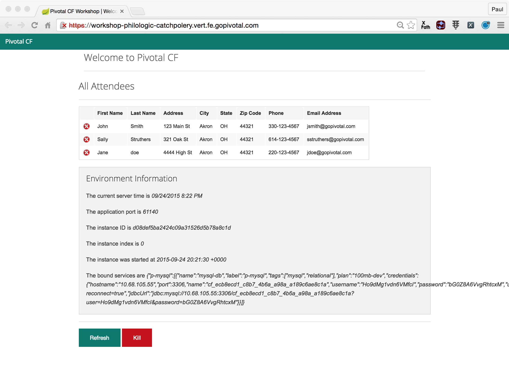

# Lab 1 - From Zero to Pushing Your First Application

## Target

If you haven't already, complete the prequisites and environment setup: [Get Environment Access](https://github.com/phopper-pivotal/pcf_an_animiated_short/blob/master/labs/labaccess.md)

## Download
Download the code, binaries and slides:

`git clone https://github.com/phopper-pivotal/pcf_an_animiated_short.git`

## Target
Set the API target for the CLI: (set appropriate end point for your environment)

`$ cf api https://api.sys.cfapp.org --skip-ssl-validation`

Login to Pivotal Cloudfoundry:

`$ cf login`

Follow the prompts

## Push It!

Change directory to the _labs/cf-spring-mvc-boot_ sample application:

`$ cd apps/cf-spring-mvc-boot`

Push the application!

`$ cf push`

You should see output similar to the following listing. Take a look at the listing callouts for a play-by-play of what's happening:
~~~~
Using manifest file /Users/phopper/Documents/pcf_an_animiated_short/apps/cf-spring-mvc-boot/manifest.yml <1>

Creating app workshop in org cerner-cts / space dev as admin...
OK <2>

Creating route workshop-noncreditable-petrol.cfapps.haas-100.pez.pivotal.io...
OK <3>

Binding workshop-noncreditable-petrol.cfapps.haas-100.pez.pivotal.io to workshop...
OK <4>

Uploading workshop... <5>
Uploading app files from: /Users/phopper/workspace/pcf_an_animated_short/labs/cf-spring-mvc-boot/target/cf-spring-mvc-boot-0.0.1-SNAPSHOT.jar
Uploading 10.6M, 153 files
Done uploading               
OK

Starting app workshop in org cerner-cts / space dev as admin... <6>
Downloading binary_buildpack...
Downloading nodejs_buildpack...
Downloading python_buildpack...
Downloading staticfile_buildpack...
Downloading php_buildpack...
Downloaded staticfile_buildpack
Downloaded binary_buildpack
Downloaded python_buildpack
Downloading ruby_buildpack...
Downloading java_buildpack_offline...
Downloading dotnet_core_buildpack...
Downloaded nodejs_buildpack
Downloading go_buildpack...
Downloaded php_buildpack
Downloaded java_buildpack_offline
Downloaded ruby_buildpack
Downloaded go_buildpack
Downloaded dotnet_core_buildpack
Cell 92b928e1-c03b-4954-8148-38ee13fedcee creating container for instance d8c43375-386e-4c7f-b8fa-8b08f308bbcc
Cell 92b928e1-c03b-4954-8148-38ee13fedcee successfully created container for instance d8c43375-386e-4c7f-b8fa-8b08f308bbcc
Downloading app package...
Downloaded app package (26.7M)
-----> Java Buildpack v4.10 (offline) | https://github.com/cloudfoundry/java-buildpack.git#978e329
-----> Downloading Jvmkill Agent 1.12.0_RELEASE from https://java-buildpack.cloudfoundry.org/jvmkill/trusty/x86_64/jvmkill-1.12.0_RELEASE.so (found in cache)
-----> Downloading Open Jdk JRE 1.8.0_162 from https://java-buildpack.cloudfoundry.org/openjdk/trusty/x86_64/openjdk-1.8.0_162.tar.gz (found in cache)
       Expanding Open Jdk JRE to .java-buildpack/open_jdk_jre (1.2s) <7>
       JVM DNS caching disabled in lieu of BOSH DNS caching
-----> Downloading Open JDK Like Memory Calculator 3.11.0_RELEASE from https://java-buildpack.cloudfoundry.org/memory-calculator/trusty/x86_64/memory-calculator-3.11.0_RELEASE.tar.gz (found in cache)
       Loaded Classes: 16164, Threads: 250
-----> Downloading Client Certificate Mapper 1.6.0_RELEASE from https://java-buildpack.cloudfoundry.org/client-certificate-mapper/client-certificate-mapper-1.6.0_RELEASE.jar (found in cache)
-----> Downloading Container Security Provider 1.13.0_RELEASE from https://java-buildpack.cloudfoundry.org/container-security-provider/container-security-provider-1.13.0_RELEASE.jar (found in cache)
-----> Downloading Spring Auto Reconfiguration 2.4.0_RELEASE from https://java-buildpack.cloudfoundry.org/auto-reconfiguration/auto-reconfiguration-2.4.0_RELEASE.jar (found in cache)
Exit status 0
Uploading droplet, build artifacts cache...
Uploading build artifacts cache...
Uploading droplet...
Uploaded build artifacts cache (132B)
Uploaded droplet (72.9M) <8>
Uploading complete
Cell 92b928e1-c03b-4954-8148-38ee13fedcee stopping instance ce02f395-ca67-42ae-9066-e746558dea69
Cell 92b928e1-c03b-4954-8148-38ee13fedcee destroying container for instance ce02f395-ca67-42ae-9066-e746558dea69
Cell 92b928e1-c03b-4954-8148-38ee13fedcee successfully destroyed container for instance ce02f395-ca67-42ae-9066-e746558dea69

0 of 1 instances running, 1 starting
1 of 1 instances running

App started

OK

App workshop was started using this command `JAVA_OPTS="-agentpath:$PWD/.java-buildpack/open_jdk_jre/bin/jvmkill-1.12.0_RELEASE=printHeapHistogram=1 -Djava.io.tmpdir=$TMPDIR -Djava.ext.dirs=$PWD/.java-buildpack/container_security_provider:$PWD/.java-buildpack/open_jdk_jre/lib/ext -Djava.security.properties=$PWD/.java-buildpack/java_security/java.security $JAVA_OPTS" && CALCULATED_MEMORY=$($PWD/.java-buildpack/open_jdk_jre/bin/java-buildpack-memory-calculator-3.11.0_RELEASE -totMemory=$MEMORY_LIMIT -stackThreads=250 -loadedClasses=16873 -poolType=metaspace -vmOptions="$JAVA_OPTS") && echo JVM Memory Configuration: $CALCULATED_MEMORY && JAVA_OPTS="$JAVA_OPTS $CALCULATED_MEMORY" && MALLOC_ARENA_MAX=2 SERVER_PORT=$PORT eval exec $PWD/.java-buildpack/open_jdk_jre/bin/java $JAVA_OPTS -cp $PWD/. org.springframework.boot.loader.JarLauncher` <9>

Showing health and status for app workshop in org cerner-cts / space dev as admin... <10>
OK

requested state: started
instances: 1/1
usage: 1G x 1 instances
urls: workshop-noncreditable-petrol.cfapps.haas-100.pez.pivotal.io
last uploaded: Wed Jun 13 23:56:03 UTC 2018
stack: cflinuxfs2
buildpack: client-certificate-mapper=1.6.0_RELEASE container-security-provider=1.13.0_RELEASE java-buildpack=v4.10-offline-https://github.com/cloudfoundry/java-buildpack.git#978e329 java-main java-opts java-security jvmkill-agent=1.12.0_RELEASE open-jdk-...

     state     since                    cpu    memory        disk           details
#0   running   2018-06-13 06:56:47 PM   0.0%   14.3M of 1G   154.3M of 1G
~~~~
1. The CLI is using a manifest to provide necessary configuration details such as application name, memory to be allocated, and path to the application artifact.
Take a look at `manifest.yml` to see how.
2. In most cases, the CLI indicates each Cloud Foundry API call as it happens.
In this case, the CLI has created an application record for _Workshop_ in your assigned space.
3. All HTTP/HTTPS requests to applications will flow through Cloud Foundry's front-end router called [Router](https://docs.pivotal.io/pivotalcf/2-1/concepts/architecture/#router).
Here the CLI is creating a route with random word tokens inserted (again, see `manifest.yml` for a hint!) to prevent route collisions across the default `devcloudwest.inbcu.com` domain.
4. Now the CLI is _binding_ the created route to the application.
Routes can actually be bound to multiple applications to support techniques such as [Blue / Green Deploys](https://docs.pivotal.io/pivotalcf/2-1/devguide/deploy-apps/blue-green.html).
5. The CLI finally uploads the application bits to Pivotal Cloudfoundry. Notice that it's uploading _75 files_! This is because Cloud Foundry actually explodes a ZIP artifact before uploading it for caching purposes.
6. Now we begin the staging process. The [Java Buildpack](https://github.com/cloudfoundry/java-buildpack) is responsible for assembling the runtime components necessary to run the application.
7. Here we see the version of the JRE that has been chosen and installed.
8. The complete package of your application and all of its necessary runtime components is called a _droplet_.
Here the droplet is being uploaded to Pivotal Cloudfoundry's internal blobstore so that it can be easily copied to one or more [Diego](https://docs.pivotal.io/pivotalcf/2-1/concepts/diego/diego-architecture.html) for execution.
9. The CLI tells you exactly what command and argument set was used to start your application.
10. Finally the CLI reports the current status of your application's health.

Visit the application in your browser by hitting the route that was generated by the CLI:

## Interact with App from CF CLI

Get information about the currently deployed application using CLI apps command:

`$ cf apps`

Note the application name for next steps

Get information about running instances, memory, CPU, and other statistics using CLI instances command

`$ cf app <<app_name>>`

Stop the deployed application using the CLI

`$ cf stop <<app_name>>`

Delete the deployed application using the CLI

`$ cf delete <<app_name>>`