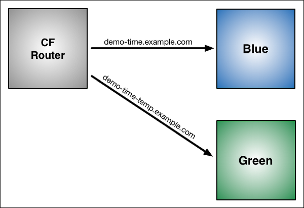

# Lab 3 - Operating your Application

Pivotal Cloud Foundry makes the work of performing operations actions, such as scaling, doing a zero-downtime deploy, and managing application health very easy.

In the next two labs we'll explore Pivotal Cloudfoundry operations.

## Scale the Application Up

Now let's increase the number of running application instances to 3.  For this lab you can use the Java, Ruby, or Node.js sample app.  In each of the commands below replace _workshop_ with the name of your deployed application:

~~~~
$ cf scale -i 3 workshop
Scaling app workshop in org cerner-cts / space dev as admin...
OK
~~~~

In reporting `OK`, the CLI is letting you know that the additional requested instances have been started, but they are not yet necessarily running.

We can determine how many instances are actually running like this:

~~~~
$ cf app workshop
Showing health and status for app workshop in org cerner-cts / space dev as admin...

name:              workshop
requested state:   started
instances:         3/3
usage:             1G x 3 instances
routes:            workshop-stromatic-capacitation.cfapps.haas-100.pez.pivotal.io
last uploaded:     Wed 13 Jun 19:19:21 CDT 2018
stack:             cflinuxfs2
buildpack:         client-certificate-mapper=1.6.0_RELEASE container-security-provider=1.13.0_RELEASE
                   java-buildpack=v4.10-offline-https://github.com/cloudfoundry/java-buildpack.git#978e329 java-main
                   java-opts java-security jvmkill-agent=1.12.0_RELEASE open-jdk-...

     state     since                  cpu     memory         disk           details
#0   running   2018-06-14T00:29:05Z   0.2%    335.7M of 1G   154.3M of 1G   <1>
#1   starting  2018-06-14T00:34:09Z   51.1%   310.8M of 1G   154.3M of 1G   <2>
#2   starting  2018-06-14T00:34:09Z   0.2%    320M of 1G     154.3M of 1G
~~~~
1. This application instance has completed the startup process and is actually able to accept requests.
2. This application instance is still starting and will not have any requests routed to it.

Eventually all instances will converge to a running state:

~~~~
$ cf app workshop
Showing health and status for app workshop in org cerner-cts / space dev as admin...

name:              workshop
requested state:   started
instances:         3/3
usage:             1G x 3 instances
routes:            workshop-stromatic-capacitation.cfapps.haas-100.pez.pivotal.io
last uploaded:     Wed 13 Jun 19:19:21 CDT 2018
stack:             cflinuxfs2
buildpack:         client-certificate-mapper=1.6.0_RELEASE container-security-provider=1.13.0_RELEASE
                   java-buildpack=v4.10-offline-https://github.com/cloudfoundry/java-buildpack.git#978e329 java-main
                   java-opts java-security jvmkill-agent=1.12.0_RELEASE open-jdk-...

     state     since                  cpu     memory         disk           details
#0   running   2018-06-14T00:29:05Z   0.2%    335.7M of 1G   154.3M of 1G   
#1   running   2018-06-14T00:34:09Z   51.1%   310.8M of 1G   154.3M of 1G   
#2   running   2018-06-14T00:34:09Z   0.2%    320M of 1G     154.3M of 1G
~~~~

Revisit the application route in the browser.

Refresh several times and notice what happens to the `The instance index is`

You should observe the instance index changing as you do so:

The aforementioned https://docs.pivotal.io/pivotalcf/2-1/concepts/architecture/#routing is applying a random routing algorithm to all of the application instances assigned to this route.
As an instance reaches the `running` state, its https://docs.pivotal.io/pivotalcf/2-1/concepts/architecture/#diego-cell registers that instance in the routing table assigned to its route by sending a message to Cloud Foundry's message bus.
All Router instances are subscribed to this channel and register the routes independently. This makes for very dynamic and rapid reconfiguration!

## Scale the Application Down

We can scale the application instances back down as easily as we scaled them up, using the same command structure:
~~~~
$ cf scale -i 1 workshop
Scaling app workshop in org Norty / space hopper as phopper@pivotal.io...
OK
~~~~

Check the application status again:
~~~~
$ cf app workshop
Showing health and status for app workshop in org cerner-cts / space dev as admin...

name:              workshop
requested state:   started
instances:         1/1
usage:             1G x 1 instances
routes:            workshop-stromatic-capacitation.cfapps.haas-100.pez.pivotal.io
last uploaded:     Wed 13 Jun 19:19:21 CDT 2018
stack:             cflinuxfs2
buildpack:         client-certificate-mapper=1.6.0_RELEASE container-security-provider=1.13.0_RELEASE
                   java-buildpack=v4.10-offline-https://github.com/cloudfoundry/java-buildpack.git#978e329 java-main
                   java-opts java-security jvmkill-agent=1.12.0_RELEASE open-jdk-...

     state     since                  cpu    memory       disk           details
#0   running   2018-06-14T00:29:05Z   0.2%   336M of 1G   154.3M of 1G
~~~~

As you can see, we're back down to only one instance running, and it is in fact the original index 0 that we started with.

Confirm that by again revisiting the route in the browser and checking the instance index:

## HTTP Routing

There are two ways to discover what routes, or HTTP URLs, are ampped to an application
The first is available via the CLI. Just type:

~~~~
$ cf app workshop
Showing health and status for app workshop in org cerner-cts / space dev as admin...

name:              workshop
requested state:   started
instances:         1/1
usage:             1G x 1 instances
routes:            workshop-stromatic-capacitation.cfapps.haas-100.pez.pivotal.io
last uploaded:     Wed 13 Jun 19:19:21 CDT 2018
stack:             cflinuxfs2
buildpack:         client-certificate-mapper=1.6.0_RELEASE container-security-provider=1.13.0_RELEASE
                   java-buildpack=v4.10-offline-https://github.com/cloudfoundry/java-buildpack.git#978e329 java-main
                   java-opts java-security jvmkill-agent=1.12.0_RELEASE open-jdk-...

     state     since                  cpu    memory       disk           details
#0   running   2018-06-14T00:29:05Z   0.2%   336M of 1G   154.3M of 1G
~~~~

and you'll see the list of routes in the section that says _routes_.

The second way is via the Apps Manager UI.  Click on the _Workshop_ application to view application details.  Select the _Routes_ tab to view a list of mapped routes:

We can easily add an additional route by clicking on _+ Map a Route_ and supplying the new hostname:

Navigate to the new URL in your browser window.  You should see that same application displayed!

We can just as easily remove a route by clicking on _x_ to the right of the route you wish to remove.

If you navigate to that URL you'll receive a HTTP 404 response

This is how blue-green deployments are accomplished.

## Accessing Container Contents

SSH into your app container via 'cf ssh APP_NAME' 

Reference: https://docs.pivotal.io/pivotalcf/2-1/customizing/
